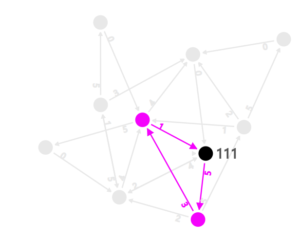
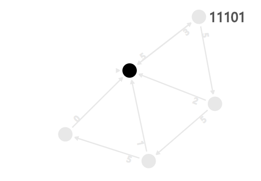
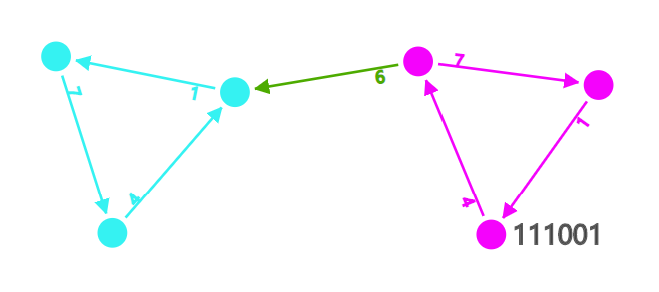

# siteswap-state-diagram
View juggling siteswap patterns and transitions in a state diagram 

live site: https://relspas.github.io/siteswap-state-diagram/

## Highlight Siteswap

## Generate Graph

## Shortest Siteswap Transition
